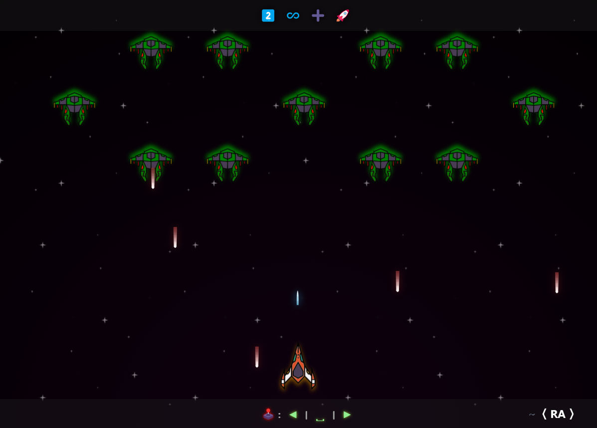

 <a href="https://https://2️⃣♾️➕🚀.ra101.dev" alt="https://https://2️⃣♾️➕🚀.ra101.dev" ><h1> https://2️⃣♾️➕🚀.ra101.dev </h1> </a>
 

  

<i>Aliens in an infinity battle formation, destroy them and go beyond infinity, or meet the maker</i>

    

**A clone of Space Invaders, specially built to be deployed with Emoji Sub-Domain!**

Changes After Fork (https://github.com/fdb/space-game):

- Enhanced Background Animation
- Changed Outro Screens
- VFX Updated
- Added More Sound-Effects
